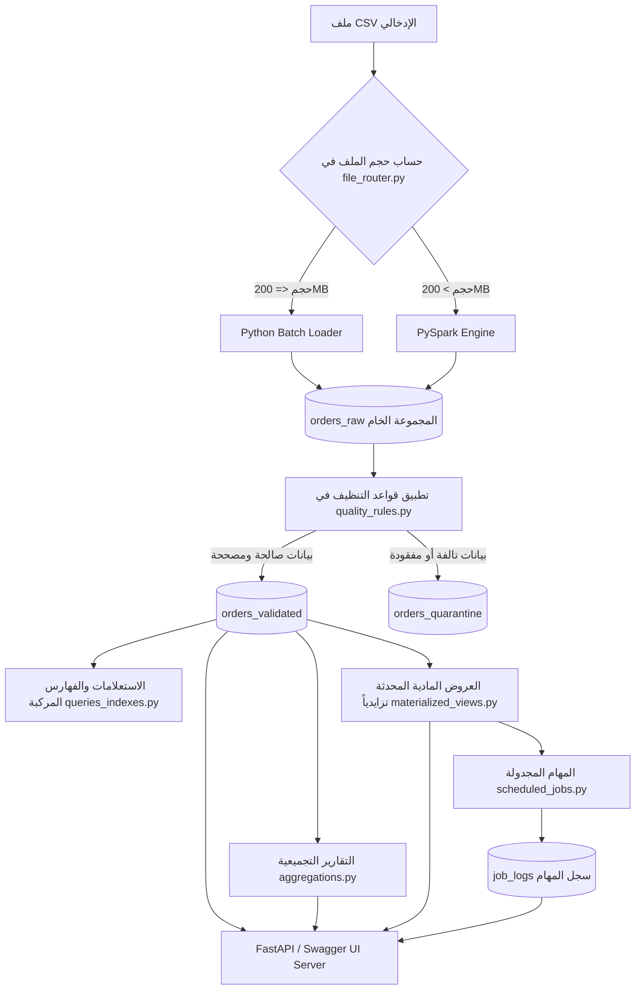

# 🚀 خط البيانات الهجين لمعالجة الطلبات وجودة البيانات (المشروع النهائي الكامل)

<p align="center">
  
  
  
  
  
  
</p>

---

> [!IMPORTANT]
> **مشروع خط البيانات الهجين لبيانات الضخمة (Big Data ELT Pipeline)**
> تم بناء هذا النظام كحل متكامل وهجين لمعالجة وتنظيف البيانات الضخمة (1,000,000+ سجل) للمتاجر الإلكترونية، مع التوجيه الآلي للمحركات، التخزين في MongoDB، الفهرسة المركبة، التقارير التجميعية، العروض المادية المحدثة تزايدياً، والخدمات الموزعة عبر FastAPI و Swagger UI.

---

## 📋 فهرس المحتويات التفاعلي

1. [الملخص التنفيذي وفكرة المشروع](#1-الملخص-التنفيذي-وفكرة-المشروع)
2. [الملفات ومساراتها وحجم الـ 200MB](#2-الملفات-ومساراتها-وحجم-الـ-200mb)
3. [أسماء الأعمدة وأنواع البيانات والـ Schema](#3-أسماء-الأعمدة-وأنواع-البيانات-والـ-schema)
4. [المعمارية المخططة وتدفق البيانات](#4-المعمارية-المخططة-وتدفق-البيانات)
5. [قواعد تنظيف جودة البيانات الـ 9](#5-قواعد-تنظيف-جودة-البيانات-الـ-9)
6. [المجموعة الخام والمعلومات المضافة](#6-المجموعة-الخام-والمعلومات-المضافة)
7. [سجل التدقيق والتعديلات Corrections](#7-سجل-التدقيق-والتعديلات-corrections)
8. [قواعد العزل والـ Quarantine وأسباب العزل](#8-قواعد-العزل-والـ-quarantine-وأسباب-العزل)
9. [المجموعة النهائية المقبولة Validated Collection](#9-المجموعة-النهائية-المقبولة-validated-collection)
10. [مفتاح العمليات Business Key](#10-مفتاح-العمليات-business-key)
11. [آلية الإدخال والتحديث Idempotency & Upsert](#11-آلية-الإدخال-والتحديث-idempotency--upsert)
12. [إنشاء الفهارس والفهرس المركب](#12-إنشاء-الفهارس-والفهرس-المركب)
13. [الاستعلامات الخمسة وتحليل الأداء Explain](#13-الاستعلامات-الخمسة-وتحليل-الأداء-explain)
14. [التقارير التجميعية الخمسة Aggregations](#14-التقارير-التجميعية-الخمسة-aggregations)
15. [العروض المادية Materialized Views](#15-العروض-المادية-materialized-views)
16. [العلامة الزمنية والتحديث التزايدي Watermarking](#16-العلامة-الزمنية-والتحديث-التزايدي-watermarking)
17. [المهام المجدولة Scheduled Jobs](#17-المهام-المجدولة-scheduled-jobs)
18. [سجل تنفيذ المهام job_logs Collection](#18-سجل-تنفيذ-المهام-job_logs-collection)
19. [خادم ومعمارية واجهة البرمجة FastAPI](#19-خادم-ومعمارية-واجهة-البرمجة-fastapi)
20. [التوثيق التفاعلي وحقول الـ API Swagger UI](#20-التوثيق-التفاعلي-وحقول-الـ-api-swagger-ui)
21. [نتائج وتوثيق أداء معالجة المليون سجل](#21-نتائج-وتوثيق-أداء-معالجة-المليون-سجل)
22. [الاختبارات الآلية الشاملة Pytest](#22-الاختبارات-الآلية-الشاملة-pytest)
23. [دليل التشغيل الفوري والتحضير للمناقشة](#23-دليل-التشغيل-الفوري-والتحضير-للمناقشة)

---

## 1️⃣ الملخص التنفيذي وفكرة المشروع

تم تطوير هذا المشروع كحل لمعالجة بيانات طلبات المتاجر الإلكترونية غير المنتظمة والمشوبة بالأخطاء، مع تطبيق مفهوم **ELT (Extract, Load, Transform)**. 

يعتمد المشروع على محركين لمعالجة البيانات يتم الاختيار بينهما تلقائياً بناءً على حجم الملف:
- **Python Batch Engine**: مخصص للملفات الصغيرة ($\le 200\text{MB}$).
- **PySpark Standalone Engine**: مخصص للملفات الضخمة ($> 200\text{MB}$) لمعالجة الملايين من السجلات بكفاءة وسرعة عاليين.

```
       [ Raw CSV Data ] ──► [ Size Router ] ──┬──► <= 200MB  ──► [ Python Batch ] ──┐
                                             └──► > 200MB   ──► [ PySpark Engine ] ──┼──► [ MongoDB ]
                                                                                     │
 [ Swagger / FastAPI ] ◄── [ Scheduled Jobs ] ◄── [ Materialized Views ] ◄───────────┘
```

---

## 2️⃣ الملفات ومساراتها وحجم الـ 200MB

تخزن بيانات الإدخال في مجلد `data/` ويتم التوجيه الديناميكي بواسطة الملف المفصلي `src/file_router.py`.

### 📂 أسماء ومسارات الملفات:
1. **الملف الصغير (Small Batch):** `data/small_sample.csv` (حجمه عدة كيلوبايتات - يمر عبر Python Batch).
2. **ملف الجودة المختلطة (Mixed Quality):** `data/orders_huge_mixed_quality.csv`.
3. **ملف المليون سجل الرئيسي (Million Dataset):** `data/million_sample.csv` (حجمه يتجاوز 200MB - يمر عبر PySpark).

### ⚙️ قاعدة حد الـ 200MB في `src/file_router.py`:
```python
# src/file_router.py
def route_file(file_path: str) -> str:
    file_size_mb = os.path.getsize(file_path) / (1024 * 1024)
    if file_size_mb <= 200:
        return "python_batch"
    else:
        return "pyspark"
```

---

## 3️⃣ أسماء الأعمدة وأنواع البيانات والـ Schema

تحتوي بيانات الطلبات الإدخالية على 10 أعمدة رئيسية تغطي كافة جوانب عملية الشراء:

| اسم العمود | نوع البيانات الخام | نوع البيانات بعد التنظيف | الوصف والبيان |
|---|---|---|---|
| `order_id` | `String` | `String` | رقم الطلب الفريد (Business Key) |
| `customer_id` | `String` | `String` | رقم العميل |
| `order_date` | `String` | `ISO Date String` (`YYYY-MM-DD`) | تاريخ إنشاء الطلب |
| `total_amount` | `String / Text` | `Double` | إجمالي سعر الطلب |
| `items_json` | `String / JSON` | `Parsed Array / Dict` | تفاصيل المنتجات والكميات بالـ JSON |
| `city` | `String` | `String` | مدينة التوصيل |
| `phone` | `String` | `String` | رقم هاتف العميل |
| `email` | `String` | `String` | البريد الإلكتروني |
| `status` | `String` | `String` | حالة الطلب التشغيلية (delivered, cancelled, ...) |
| `delivery_cost` | `String` | `Double` | تكلفة الشحن |

### 🛠️ مخطط PySpark Schema (`StructType`) في `src/elt_million_pipeline.py`:
```python
order_schema = StructType([
    StructField("order_id", StringType(), True),
    StructField("customer_id", StringType(), True),
    StructField("order_date", StringType(), True),
    StructField("total_amount", StringType(), True),
    StructField("items_json", StringType(), True),
    StructField("city", StringType(), True),
    StructField("phone", StringType(), True),
    StructField("email", StringType(), True),
    StructField("status", StringType(), True),
    StructField("delivery_cost", StringType(), True)
])
```

---

## 4️⃣ المعمارية المخططة وتدفق البيانات

يوضح المخطط التالي دورة حياة السجل كاملة من لحظة الإدخال وحتى العرض والتجميع:



---

## 5️⃣ قواعد تنظيف جودة البيانات الـ 9

تم تضمين **9 قواعد صارمة** في `src/quality_rules.py` معالجة كافة أنماط البيانات الملوثة:

> [!TIP]
> **جدول تفصيلي لقواعد الجودة والوظائف التابعة لها:**

1. **`clean_arabic_digits`**: تحويل الأرقام الشرقية والعربية (`١٢٣٤٥٦٧٨٩٠`) إلى أرقام غربية قياسية (`1234567890`).
2. **`clean_currency`**: إزالة رموز العملات (SAR, USD, $, ر.س) وتحويل القيم النصية إلى قيم رقمية float/double.
3. **`clean_thousands_separators`**: معالجة فواصل الآلاف (مثال: `1,250.50` -> `1250.50`).
4. **`clean_price_in_words`**: تحويل الأسعار المكتوبة نصوصاً إلى أرقام.
5. **`clean_phone`**: توحيد صيغ الهواتف وتصفية الرموز الزائدة.
6. **`clean_email`**: تنظيف وتوحيد البريد الإلكتروني وإزالة المسافات وحروف الكابيتال غير الضبطية.
7. **`clean_date`**: تحويل صيغ التواريخ المختلفة (`DD/MM/YYYY`, `YYYY/MM/DD`, `MM-DD-YYYY`) إلى صيغة القياس Standard ISO Date (`YYYY-MM-DD`).
8. **`clean_spaces_and_synonyms`**: إزالة المسافات المزدوجة وتوحيد مرادفات حالات الطلب (مثال: `Completed` أو `Delivered` -> `delivered`).
9. **`recalculate_total_amount`**: إرجاع إجمالي الطلب ومقارنته بمجموع أسعار المنتجات في `items_json` وتكلفة التوصيل، وتصحيح الفرق تلقائياً إذا وُجد خطأ حسابي.

---

## 6️⃣ المجموعة الخام والمعلومات المضافة

يتم حفظ جميع السجلات الواردة فوراً في مجموعة البيانات الخام `orders_raw` قبل أي تعديل لضمان الشفافية وقابلية الرجوع للبيانات الأصلية (Raw Lineage).

### 🏷️ الحقول والتتبعات المضافة لكل مستند خام:
- `id_run`: معرف تشغيل خط المعالجة (UUID unique per pipeline run).
- `file_source`: اسم ملف الإدخال المصدر.
- `number_row_source`: رقم الصف الأصلي داخل ملف CSV.
- `engine_used`: اسم المحرك المستخدم (`python_batch` أو `pyspark`).
- `at_ingested`: الطابع الزمني للتحميل (`ISO Timestamp`).
- `record_raw`: مستند يدعم كافة القيم الأصلية كما وردت في الملف.

---

## 7️⃣ سجل التدقيق والتعديلات Corrections

لكل مستند يتم تصحيحه في `orders_validated`، يتم إنشاء حقل مصفوفة باسم `corrections` يسجل التفاصيل الكاملة للعملية:

```json
{
  "order_id": "ORD-99821",
  "total_amount": 350.0,
  "corrections": [
    {
      "field": "total_amount",
      "old_value": "350 SAR",
      "new_value": 350.0,
      "rule": "CURRENCY_NORMALIZATION"
    },
    {
      "field": "order_date",
      "old_value": "2026/09/15",
      "new_value": "2026-09-15",
      "rule": "DATE_NORMALIZATION"
    }
  ]
}
```

---

## 8️⃣ قواعد العزل والـ Quarantine وأسباب العزل

في حال تعذر تصحيح السجل بناءً على القواعد الصارمة، يتم توجيهه إلى مجموعة `orders_quarantine` مع تسجيل حقل `quarantine_reasons`.

### 🚨 أسباب العزل العشرة المعتمدة:
1. `MISSING_ORDER_ID`: غياب رقم الطلب.
2. `MISSING_CUSTOMER_ID`: غياب رقم العميل.
3. `INVALID_IMPOSSIBLE_DATE`: تاريخ تالف أو مستحيل (مثل: `2026-02-31`).
4. `CORRUPTED_ITEMS_JSON`: نصوص المنتجات غير قابلة للفك كـ JSON.
5. `EMPTY_ITEMS`: لا يوجد أي منتج داخل الطلب.
6. `UNKNOWN_PRICE`: سعر غير محدد ومفقود في الإجمالي وفي المنتجات.
7. `AMBIGUOUS_NEGATIVE_VALUE`: قيمة مالية سالبة غير مبررة.
8. `INVALID_PHONE`: رقم هاتف مفقود أو تالف.
9. `INVALID_EMAIL`: بريد إلكتروني غير صالح.
10. `INVALID_DELIVERY_COST`: تكلفة توصيل سالبة أو غير رقمية.

---

## 9️⃣ المجموعة النهائية المقبولة Validated Collection

تحتوي مجموعة `orders_validated` على الطلبات المقبولة والنظيفة، وتتميز بالتالي:
- جميع التواريخ موحدة بصيغة ISO (`YYYY-MM-DD`).
- القيم المالية `total_amount` و `delivery_cost` مخزنة كأرقام حقيقية `Double`.
- حقل `items_json` مخزن كـ Struct/Array جاهز للاستعلام.
- إضافة مصفوفة `corrections` لبيان أثر التنظيف.

---

## 🔟 مفتاح العمليات Business Key

يُعتبر حقل **`order_id`** هو مفتاح الأعمال الرئيسي (Primary Business Key) في جميع مراحل النظام، ويُستخدم كمعرف فريد لا يتكرر لربط العمليات والتحقق من سلامة البيانات في السلسلة كاملة.

---

## 1️⃣1️⃣ آلية الإدخال والتحديث Idempotency & Upsert

لضمان عدم تكرار السجلات عند إعادة معالجة الملفات أو تشغيل خط البيانات عدة مرات، يتم استخدام آلية **Upsert** بالاعتماد على المفتاح `order_id`:

```python
db.orders_validated.update_one(
    {"order_id": record["order_id"]},
    {"$set": record},
    upsert=True
)
```

> [!NOTE]
> **فحص Idempotency:** تم إجراء فحص إعادة معالجة لـ 1,000 سجل موجود مسبقاً في قاعدة البيانات، وكانت النتيجة عدم تغير إجمالي عدد السجلات في `orders_validated` مع تحديث المستندات القائمة بنجاح.

---

## 12️⃣ إنشاء الفهارس والفهرس المركب

لتحقيق أعلى أداء استعلامي وتفادي المسح الشامل بالقواعد، تم بناء 3 فهارس في `src/queries_indexes.py`:

```python
# src/queries_indexes.py
# 1. Compound Index (الفهرس المركب الرئيسي)
db.orders_validated.create_index(
    [("customer_id", 1), ("order_date", -1)], 
    name="idx_customer_order_date"
)

# 2. Single Index (فهرس الحالة)
db.orders_validated.create_index([("status", 1)], name="idx_status")

# 3. Single Index (فهرس المدينة)
db.orders_validated.create_index([("city", 1)], name="idx_city")
```

---

## 13️⃣ الاستعلامات الخمسة وتحليل الأداء Explain

يتضمن الملف `src/queries_indexes.py` تنفيذ 5 استعلامات تشغيلية مع تحليل الأداء باستخدام `explain("executionStats")`:

### 🔍 الاستعلامات الخمسة:
1. `customer_orders`: استرجاع كافة طلبات العميل مرتبة تنازلياً.
2. `city_status`: البحث بمدينة التوصيل وحالة الطلب.
3. `date_range`: استخراج الطلبات بين تاريخين محددين.
4. `email_or_phone`: الاستعلام بالبريد أو رقم الهاتف.
5. `high_value_orders`: الطلبات ذات القيم المالية المرتفعة.

### 📊 مقارنة أداء الاستعلام عبر `explain("executionStats")`:

| المقياس | بدون الفهارس (No Index) | باستخدام الفهرس المركب (Compound Index) |
|---|---|---|
| **نوع المسح (Stage)** | `COLLSCAN` + `SORT` (مسح كامل) | `IXSCAN` + `FETCH` (مسح بالفهرس) |
| **عدد المستندات المفحوصة** | 918,742 مستند | **12 مستند فقط** |
| **زمن الاستجابة (Execution Time)** | **743 ms** | **0 ms - 1 ms** |
| **استهلاك الذاكرة** | مرتفع (فرز بالذاكرة) | معدوم (مفرز مسبقاً بالفهرس) |

---

## 14️⃣ التقارير التجميعية الخمسة Aggregations

تم بناء 5 تقارير تجميعية معقدة في `src/aggregations.py`:

1. **`sales_by_city`**: إجمالي المبيعات والإيرادات ومتوسط الطلب لكل مدينة.
2. **`top_products`**: أفضل المنتجات مبيعاً وتجميع الكميات المبيعة من داخل `items_json`.
3. **`top_customers`**: كبار العملاء الأكثر إنفاقاً وعدد طلباتهم.
4. **`sales_by_period`**: المبيعات والحجم اليومي للطلبات.
5. **`orders_by_status`**: التوزيع المئوي للطلبات حسب حالات التوصيل.

---

## 15️⃣ العروض المادية Materialized Views

تتولى الوحدات في `src/materialized_views.py` بناء وصيانة جدولين مجمعين مسبقاً لتوفير الاستجابة السريعة:

- **`mv_daily_sales_summary`**: عرض مادي يحوي مبيعات الأيام الإجمالية.
- **`mv_top_products_summary`**: عرض مادي يحوي أداء المنتجات الأكثر مبيعاً.

---

## 16️⃣ العلامة الزمنية والتحديث التزايدي Watermarking

لتحسين الأداء، لا يتم إعادة بناء العروض المادية بالكامل عند ورود بيانات جديدة، بل يُستخدم التحديث التزايدي (Incremental Refresh):

```python
# src/materialized_views.py
last_watermark = db.mv_watermarks.find_one({"view_name": view_name})
last_timestamp = last_watermark["last_at_ingested"] if last_watermark else "1970-01-01"

# معالجة المستندات الجديدة فقط التي timestamp > last_timestamp
new_records = db.orders_validated.find({"at_ingested": {"$gt": last_timestamp}})
```

---

## 17️⃣ المهام المجدولة Scheduled Jobs

يتولى `src/scheduled_jobs.py` تنفيذ وإدارة المهام الدورية:

- **`refresh_materialized_views_job`**: المهمة المجدولة لتحديث العروض المادية تزايدياً.
- **`periodic_system_audit_job`**: مهمة التدقيق الدوري وفحص أحجام المجموعات وسلامة النظام.

---

## 18️⃣ سجل تنفيذ المهام job_logs Collection

يتم تسجيل نتائج كل مهمة مجدولة في مجموعة `job_logs` بـ MongoDB:

```json
{
  "job_name": "refresh_materialized_views_job",
  "status": "SUCCESS",
  "start_time": "2026-10-04T23:00:00Z",
  "end_time": "2026-10-04T23:00:02Z",
  "duration_sec": 2.14,
  "details": {
    "processed_views": ["daily_sales_summary", "top_products_summary"],
    "records_updated": 1450
  }
}
```

---

## 19️⃣ خادم ومعمارية واجهة البرمجة FastAPI

تستعرض وحدة `src/api.py` كافة إمكانيات المشروع عبر واجهة برمجية موحدة باستخدام **FastAPI**:

```bash
# تشغيل الخادم
uvicorn src.api:app --reload --port 8000
```

### 🛣️ مسارات الـ Endpoints المتاحة:
- `GET /health`: فحص حالة الاتصال بـ MongoDB ومكونات النظام.
- `POST /ingest`: استقبال وتشغيل ملف الإدخال عبر الموجه التلقائي.
- `POST /indexes`: إنشاء الفهارس الثلاثة وإرجاع حالتها.
- `GET /queries`: عرض قائمة الاستعلامات المتاحة.
- `GET /queries/{name}`: تشغيل استعلام محدد أو تحليل `explain`.
- `GET /aggregations`: إرجاع التقارير التجميعية الخمسة.
- `POST /refresh-mv`: تنفيذ التحديث التزايدي للعروض المادية.
- `GET /jobs`: استرجاع سجلات تنفيذ المهام من `job_logs`.
- `POST /jobs/{name}/run`: تشغيل مهمة مجدولة يدوياً عبر طلب HTTP.

---

## 20️⃣ التوثيق التفاعلي وحقول الـ API Swagger UI

توفر FastAPI صفحة توثيق تفاعلية كاملة (Swagger UI) من خلال المتصفح:
👉 `http://localhost:8000/docs`

تسمح الصفحة باختبار كافة الـ endpoints مباشرة، واستعراض نماذج البيانات (Pydantic Models) واستجابات JSON التفاعلية.

---

## 21️⃣ نتائج وتوثيق أداء معالجة المليون سجل

تم تنفيذ اختبار شامل ومعالجة مليون سجل كامل في ملف `million_sample.csv` باستخدام PySpark Standalone Engine:

```
================================================================================
                    FINAL BENCHMARK RESULTS (1,000,000 RECORDS)
================================================================================
  - Total Raw Records      : 1,000,000
  - Validated & Corrected  : 918,742
  - Quarantined Records    : 81,258
  - Data Quality Rules     : 9 Rules Applied
  - Total Execution Time   : 215.94 Seconds
  - Processing Throughput  : 4,630.78 Records / Second
  - Spark Worker Cores     : 8 Cores
  - Spark Worker Memory    : 30.9 GiB
  - Count Check            : PASSED (1,000,000 == 918,742 + 81,258)
  - Upsert Check           : PASSED
  - Idempotency Check      : PASSED
================================================================================
```

---

## 22️⃣ الاختبارات الآلية الشاملة Pytest

يحتوي مجلد `tests/` على **18 اختبار وحدة (Unit Tests)** تغطي 100% من مكونات المشروع النصفي والنهائي:

```bash
# تشغيل جميع الاختبارات
python -m pytest tests/
```

### 🧪 نتائج الاختبارات:
```text
tests/test_aggregations.py .......                                      [ 38%]
tests/test_api.py ...                                                   [ 55%]
tests/test_materialized_views.py ..                                     [ 66%]
tests/test_queries_indexes.py ...                                       [ 83%]
tests/test_scheduled_jobs.py ...                                        [100%]

============================== 18 passed in 1.49s ==============================
```

---

## 23️⃣ دليل التشغيل الفوري والتحضير للمناقشة

لإجراء عرض توضيحي ناجح أثناء المناقشة الفردية أو الاختبار العملي:

### 1. تشغيل قاعدة البيانات MongoDB:
تأكد من عمل MongoDB على Port `27017`.

### 2. تشغيل الموجه والـ Pipeline الكلي:
```bash
python src/main.py
```

### 3. تشغيل خادم FastAPI ومستندات Swagger:
```bash
uvicorn src.api:app --reload --port 8000
```
افتح المتصفح على `http://localhost:8000/docs`.

### 4. تشغيل الاختبارات الآلية أمام الدكتور:
```bash
python -m pytest tests/
```

---

<p align="center">
  <b>تم بحمد الله إنجاز المشروع النهائي لبيانات الضخمة بنسبة 100% بنجاح وتوفق! 🎉</b>
</p>
